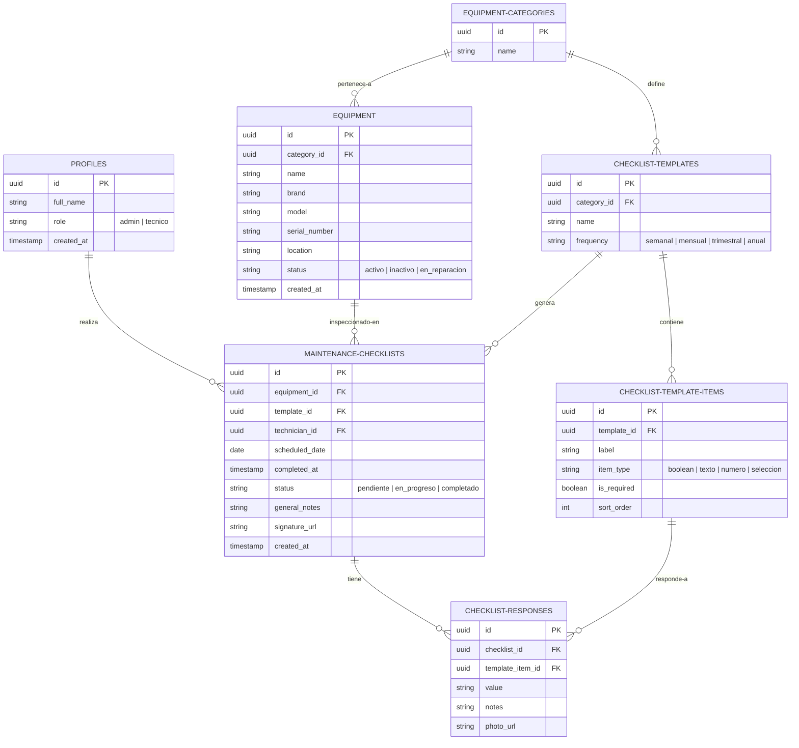

# MediCore Checklists 🏥📋

MediCore Checklists es una aplicación web moderna diseñada para la gestión, programación y realización de listas de chequeo (checklists) de mantenimiento preventivo y correctivo para equipos médicos. Permite a los administradores gestionar el inventario y plantillas, y a los técnicos de mantenimiento llenar las inspecciones, tomar fotos de evidencia y firmarlas digitalmente, incluso sin conexión a Internet.

---

## 🚀 Tecnologías Utilizadas

El proyecto utiliza un stack moderno y eficiente:

*   **Frontend**: [React 19](https://react.dev/) + [Vite](https://vite.dev/) (Rápido tiempo de desarrollo y compilación).
*   **Soporte Offline (PWA)**: [vite-plugin-pwa](https://vite-pwa-org.netlify.app/) (Service worker con estrategia de caché para el App Shell y manifiesto de aplicación).
*   **Base de Datos Local**: [Dexie.js](https://dexie.org/) (Wrapper reactivo de IndexedDB para consultas en tiempo real y persistencia de blobs).
*   **Métricas e Indicadores**: [Recharts](https://recharts.org/) (Gráficos interactivos de barra y dona).
*   **Reportes Técnicos**: [jsPDF](https://github.com/parallax/jsPDF) (Generación dinámica de informes clínicos en formato PDF directamente en el cliente).
*   **Estilos y UI**: [Tailwind CSS v4](https://tailwindcss.com/) + [Lucide React](https://lucide.dev/) (Iconos limpios) + [Canvas Confetti](https://github.com/catdad/canvas-confetti) (Celebración de checklists completados).
*   **Enrutado**: [React Router v7](https://reactrouter.com/) (Gestión de rutas y navegación protegida).
*   **Estado y Consultas**: [TanStack Query v5](https://tanstack.com/query/latest) (Gestión del estado del servidor, caché y sincronización).
*   **Base de Datos y Autenticación**: [Supabase](https://supabase.com/) (Postgres con Seguridad a Nivel de Fila - RLS).

---

## 📶 Soporte Offline y Sincronización

La aplicación está diseñada para funcionar de forma resiliente en entornos con mala señal de internet (sótanos de hospitales, laboratorios blindados, etc.) mediante la siguiente arquitectura:

1.  **Caché estática (PWA)**: El App Shell (HTML, JS, CSS y recursos de diseño) se cachea a nivel de navegador. La aplicación cargará y funcionará incluso si no hay internet al refrescar la pantalla.
2.  **Caché de Catálogo (Dexie)**: Al iniciar sesión y siempre que haya internet, la aplicación descarga y refresca de forma local el catálogo de equipos activos, plantillas de checklists e ítems de inspección.
3.  **Cola de Sincronización Local**: Cuando el técnico completa un checklist, la firma y las fotos de evidencia se capturan como **Blobs** binarios y se guardan junto con el formulario en IndexedDB.
4.  **Sincronizador en Segundo Plano (`sync.js`)**: El sistema escucha activamente el estado de red. Al detectar conexión (`online`), recorre secuencialmente los elementos locales completados:
    *   Sube los blobs de fotos y firma a **Supabase Storage** (bucket `checklist-media`).
    *   Actualiza los registros con las URLs públicas definitivas.
    *   Sube la inspección a la base de datos de Supabase.
    *   Limpia la cola local una vez la carga se completa exitosamente.

---

## ✨ Funcionalidades Principales

1.  **Control de Acceso Seguro**: Autenticación persistente con redirección automática basada en roles (`admin` y `tecnico`).
2.  **Dashboard con Métricas de Desempeño**: Panel con gráficos de dona para medir el cumplimiento mensual y gráficos de barra para auditar el volumen de inspecciones por categoría de equipo clínico (vía *Recharts*).
3.  **Alertas de "Atención Requerida"**: Identificación inteligente de equipos con mantenimientos vencidos o próximos a vencer (en los siguientes 7 días) mediante análisis del historial y las frecuencias de plantillas.
4.  **Gestión e Inventariado de Equipos**: Inventario de equipos clínicos clasificados por categorías con estados operativos (Activo, Inactivo, En Reparación).
5.  **Editor de Plantillas**: Definición de checklists personalizados con múltiples tipos de campos (Booleano, Texto, Número, Selección Múltiple) para cada categoría.
6.  **Llenado Offline-First**: Formulario interactivo adaptado a dispositivos móviles con soporte para adjuntar fotos de evidencia por ítem, indicar el progreso y firmar digitalmente.
7.  **Historial y Descarga de PDF**: Auditoría de checklists completados con visualización de firmas y fotos. Incluye descarga instantánea de reportes técnicos a PDF que incorporan de forma fluida tablas, notas y recursos multimedia (vía *jsPDF*).

---

## 📂 Estructura del Directorio

```text
medicore-checklists/
├── supabase/
│   └── migrations/
│       └── 0001_init.sql         # Esquema de base de datos inicial y políticas de RLS
├── src/
│   ├── assets/                   # Recursos estáticos (imágenes, logos)
│   ├── components/
│   │   ├── checklist/            # Formularios de checklist, captura de firma e ítems con cámara
│   │   ├── equipment/            # Componentes para visualización y formularios de equipos
│   │   ├── layout/               # Elementos del Layout (Navbar, Sidebar, OfflineIndicator)
│   │   └── ui/                   # Componentes atómicos reutilizables (Botones, Tarjetas, Badges)
│   ├── context/
│   │   └── AuthContext.jsx       # Contexto para manejo del estado de autenticación y auto-sync
│   ├── hooks/
│   │   ├── useChecklists.js      # Hooks de React Query para checklists remotos
│   │   ├── useEquipment.js       # Hooks de React Query para gestionar equipos remotos
│   │   ├── useTemplates.js       # Hooks de React Query para plantillas remotas
│   │   └── useOnlineStatus.js    # Hook personalizado para detectar red y conteo en IndexedDB
│   ├── lib/
│   │   ├── supabase.js           # Cliente configurado de Supabase y mock de base de datos
│   │   ├── db.js                 # Inicialización y esquema de tablas IndexedDB (Dexie)
│   │   └── sync.js               # Sincronizador en segundo plano y descarga de catálogos
│   ├── pages/
│   │   ├── Dashboard.jsx         # Panel principal con métricas, gráficos Recharts y alertas de vencimiento
│   │   ├── Login.jsx             # Pantalla de inicio de sesión
│   │   ├── EquipmentList.jsx     # Gestión e inventario de equipos médicos
│   │   ├── CategoryList.jsx      # Gestión de categorías de equipos
│   │   ├── TemplateList.jsx      # Creación y edición de plantillas de inspección
│   │   ├── ChecklistFill.jsx     # Interfaz interactiva de llenado de checklists (offline-first)
│   │   └── ChecklistHistory.jsx  # Historial, desglose de respuestas y exportación de reportes a PDF
│   ├── App.jsx                   # Enrutamiento de la aplicación y layouts generales
│   ├── index.css                 # Estilos globales y configuración de Tailwind CSS
│   └── main.jsx                  # Punto de entrada y registro de Service Worker de la PWA
├── package.json
└── README.md
```

---

## 🗄️ Modelos de Datos

### Base de Datos Local (IndexedDB / Dexie)
```javascript
db.version(1).stores({
  equipment: 'id, category_id, name, status',
  checklist_templates: 'id, category_id, name',
  checklist_template_items: 'id, template_id, label',
  pending_checklists: 'id, equipment_id, template_id, technician_id, status, scheduled_date',
  pending_responses: 'id, checklist_id, template_item_id'
})
```

### Base de Datos Centralizada (Supabase / Postgres)



---

## 🛠️ Instalación y Configuración Local

1.  **Clonar el repositorio** y acceder a él.
2.  **Instalar las dependencias**:
    ```bash
    npm install
    ```
3.  **Configurar Variables de Entorno**:
    Crea un archivo `.env` en la raíz del proyecto (puedes tomar como base `.env.example`):
    ```env
    VITE_SUPABASE_URL=tu_url_de_supabase
    VITE_SUPABASE_ANON_KEY=tu_clave_anonima_de_supabase
    ```
4.  **Iniciar Servidor de Desarrollo**:
    ```bash
    npm run dev
    ```
5.  **Compilar para Producción (Verifica generación de Service Worker)**:
    ```bash
    npm run build
    ```